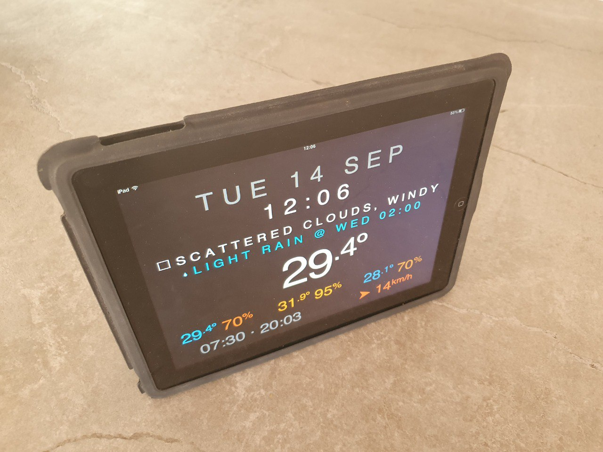
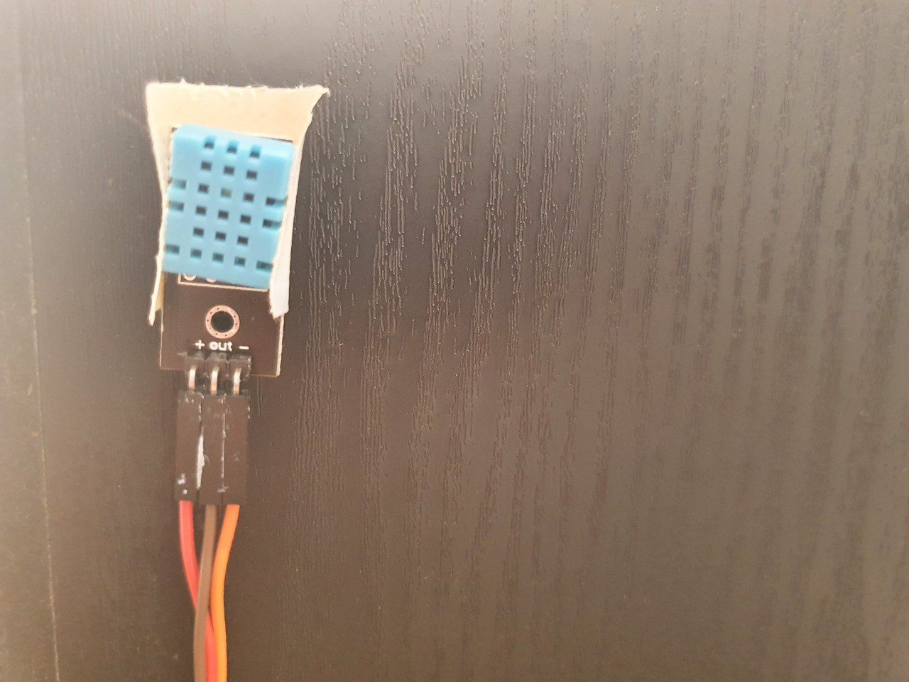
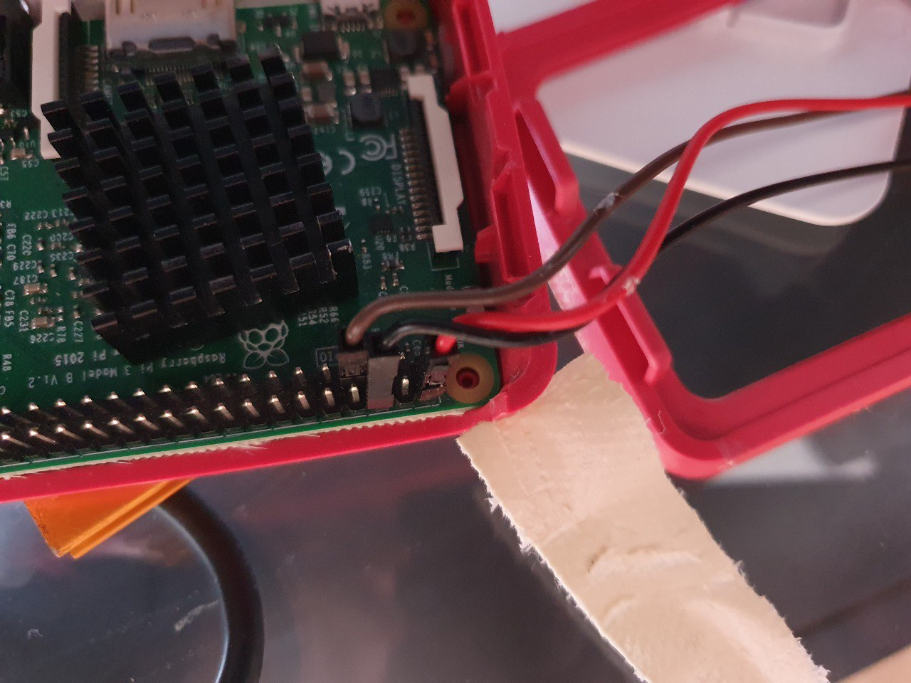
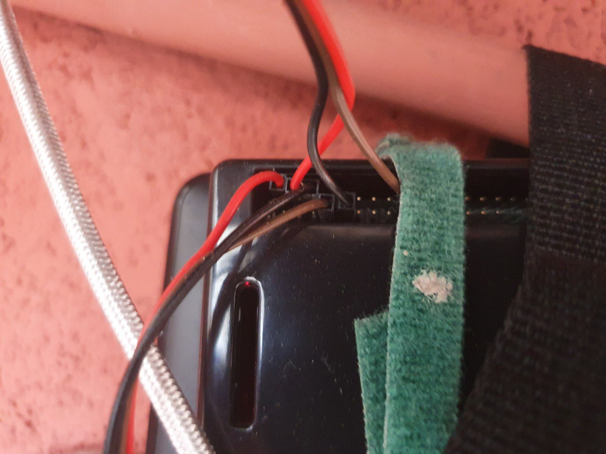
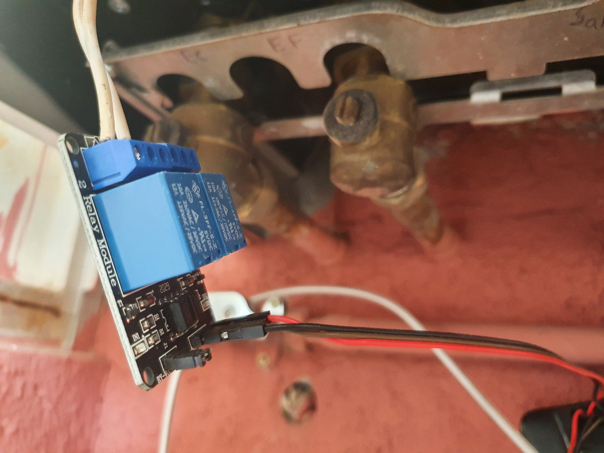
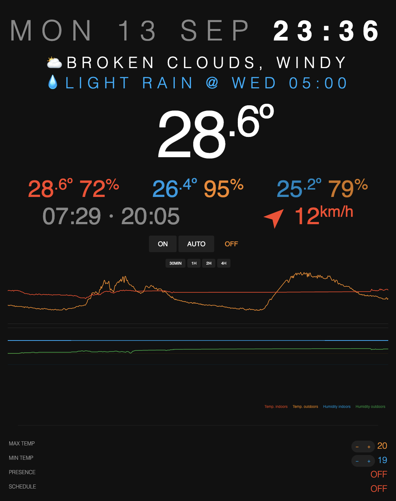

🌡 Thermostat
=======================

Smart Home Thermostat with Web interface, customizable options, weekly On/Off schedule programming, privacy-friendly presence detector and weather data.



_I've posted more photos at the bottom of the README._

## ⭐ Features

- Access your thermostat from anywhere in the world
- Control your home thermostat with your phone, laptop or tablet
- Clean web interface with Temperature and Humidity charts
- Weather data from external API (wind speed and direction, sunrise and sunset times, next rain due, etc.)
- Unlimited sensors for multiple rooms, indoors/outdoors, etc.
- Unlimited schedules to customize temperature ranges during the day and week
- Timers to turn the thermostat on for a few minutes/hours
- Charts to analyze temperature/humidity evolution
- Privacy-friendly presence detection that turns thermostat off automatically if nobody is home
- Compatible with extremely old devices (iPad 1, etc.) so you can give them another life
- Extremely easy to set up, no compiling, frameworks or libraries needed, just vanilla JS and PHP (and a few lines of Python)
- Extremely easy to hack and customize to your liking


**Disclaimer**: _Please do your own research, you will be dealing with hardware components. I may have made mistakes or your particular setup may differ._


## What you need (minimum-ideal)

- 1 or more Raspberry Pi (non-exclusive, you can use them for other things simultaneously such as for Kodi/OSMC, Syncthing or PiHole)
- 1 temperature sensor for each place you want to detect the temperature
- 1 relay switch to turn ON-OFF the thermostat
- Cable (Dupont wires, although any old USB or phone cable works too)

### Setup overview

- Put a Python script on each Raspberry Pi (with a 5 min cronjob)
- Upload a PHP script on a web server with a few files (no database needed)
- (optional) A free API key from OpenWeatherMap to get your location's weather


### 🛒 Shopping list

These are the things I bought and have worked for me, your setup may vary.

- [Raspberry Pi](https://amzn.to/2ZswT0E): any model works, I've tested it with 3B+, 4B and Zero W
- [DHT11 Temperature sensors](https://amzn.to/3tbv3LE): around 1€ each
    - or [DHT22 Temperature sensors](https://amzn.to/3zfUe24): around 6€ each, you may get a 10k Ohm resistor too
- [Relay switch](https://amzn.to/3teyIbK): 5€
- (optional) [Dupont Cables](https://amzn.to/3wSyWra): 7€, or use any old network/USB cable
- (optional) [Multimeter](https://amzn.to/2Q3ownQ): 15€
- (optional) [Cheap web server](https://xaviesteve.com/go/hetzner): link gets you 5 months free on a 4€/month server

TOTAL: 34€ max (for a fully featured smart thermostat that costs around 300-500€! 🥳)


### ✅ Compatibility

Compatible with very old devices (including iPad 1 and probably old Internet Explorers) so you can use retired devices as controllers/displays, they just need a decent web browser. The Web interface has been coded in a way that doesn't require too modern web technologies.


## 🤩 My setup

I've got two Raspberry Pi: one I use it for watching TV (using OSMC + Kodi) so it sits besides my TV in the living room and the other one (Raspberry 2) is a file backup generator (using Syncthing) placed next to my heater.

Raspberry 1 will detect indoor temperature and presence, and Raspberry 2 will detect outdoors temperature and activate the heater On/Off through the relay.

My Thermostat activates through a cable running at 26.7VAC 8.68mA (measured thanks to the Multimeter I bought). When this cable is bridged it turns ON, and when you unbridge it, it turns Off. I got a relay which can handle up to 250V and 10A, it's inexpensive and you can reuse for other projects.


- *December 2021 update*: I've upgraded my setup and now have two sensors at home, one for my Living Room and one for my Bedroom, while keeping the Outdoors one. Thermostat allows you to program which room to check for the perfect temperature based on the time of the day, so at night, it checks the bedroom temp while during the day it keeps track of the living room. Some photos and documentation may still be based on the old setup, to put it simply, adding a new temp sensor in my bedroom I can now keep track of fluctuations of temperature in the house (see if someone left the window open for too long) and to activate the thermostat only when it needs to.


### ℹ️ Overview

- Raspberry 1 (indoors, living room)
    - Hardware:
        - Temperature sensor
    - Software:
        - Send temperature and humidity
        - Detect presence
- Raspberry 2 (outdoors, next to the thermostat)
    - Hardware:
        - Relay (on/off switch) connected to the Thermostat cable
        - Temperature sensor (placed outdoors with a long cable so we get accurate exterior temperature)
    - Software:
        - Send temperature
        - GET `/status` to see if 1 or 0 and turn on or off the rele (HARD)
- Web Server (PHP):
    - PHP script
        - Web portal
            - User Interface
            - Buttons to turn thermostat On/Off and set an On timer ("_set it on for 30 minutes_")
            - Charts, indoor/outdoor/city temperatures and humidity, thermostat status, event logs
            - Customize the temperature range
        - API
            - Receive data from all devices
            - Return thermostat status


## ⚙ SETUP

### Generate a security token

You can use this tool https://xaviesteve.com/pro/tools.php (Password generator) to create a 128-256 string and save it in a file called `.httoken`. Place this file in the same folder as your `thermo.py` and `index.php` scripts.

### Customize parameters

Rename `params.py.example` to `params.py` and modify its settings for each Raspberry this should run on. Place this file next to the `thermo.py`.

(optional) You can edit `index.php` (or `params.php` once it has been generated on first run) to customize a few extra settings such as the weekly schedule, your coordinates, Weather API key and so on.


### 📟 Web Server

A PHP server publicly accessible so we can open it from anywhere in the world, we use a token to connect to it so no one except you can access it. 

No need for a database (MySQL/MariaDB, SQLite, etc.) since we use a simple file to store all data.

Just upload the files to the server once you've customized the parameters and you're good to go, no installation process is needed.


We are now going to go through the things you need to set up in your Raspberries, note that you can have one Raspberry do every role, or not, whatever you prefer:


### 📟 Thermostat Raspberry

For the Raspberry with the Thermostat ON/OFF Relay that is wired to the heater:

```bash
sudo apt update
sudo apt install wiringpi

# You probably don't need this: `sudo apt install python3-rpi.gpio python-pip`
# This shows info on all pins `gpio readall`
```

### 📟 Presence Raspberry

For the Raspberry that will do the presence detector:

```bash
pip install pythonping
```

Now give your smartphones' fixed IPs and add them to the `params.py` file.


### 📟 Temperature Raspberry

For the Raspberry with the temperature sensor:

```bash
sudo apt update
sudo apt install python3-pip
sudo python3 -m pip install --upgrade pip setuptools wheel
sudo pip3 install Adafruit_DHT dht11
```

If you are getting errors installing Adafruit, specially in Linux distros like OSMC that have trimmed down packages, try: `sudo apt-get install build-essential python3-dev`.

The GPIO pins (Raspberry Pi 4B, 3B+, 3B, 3A+, 2B, B+, A+, Zero, Zero W) for the DHT11 temperature sensor that I have used look like this:

```
                |
···········7··· |
············6·2 |
----------------/
```

- Pin 2 (5V): +
- Pin 6 (Ground): -
- Pin 7 (GPIO4): Data/out


#### Pins on the 3-pin blue DHT11:

```
###
###
###
|||

123

1: Voltage
2: Data
3: Ground
```

#### Pins on the 4-pin white DHT22:

```
####
####
####
||||

1234

1: Voltage
2: Data
3: (nothing)
4: Ground
```

##### Note on the DHT11

In your `params.py`, you may use `enable_sensor = 2` instead of `1` to use the alternative library (*szazo*) which gives you decimal precision.


##### Note on the DHT22

The DHT22 is a bit more expensive and gives better temperature/humidity readings, specially in cold weather. I have both at home, I don't really care if it's 18.5C or 19.0C outside, so the DHT11 is outside and the DHT22 are indoors.

Some users report you need a 10k ohm resistor as per https://pimylifeup.com/raspberry-pi-humidity-sensor-dht22/ instructions, this means you'll either need a board or to solder a bit, which may be inconvenient if you're just starting out. While you could exclude the resistor you will likely start to get unreliable measurements from the sensor. In my case, I am not using the resistor and the readings are fine, the Thermostat code already detects some of these missreadings and avoids them. Read the FAQs if you are not sure which one to get.


### 📟 All Raspberries

Set a static IP on all your Raspberry Pi:

```bash
sudo nano /etc/resolv.conf
```

Scroll to the bottom and add this:

```bash
interface wlan0
static ip_address=192.168.0.201/24
static routers=192.168.0.1
static domain_name_servers=192.168.0.1
```

Now put the token on all your Raspberry Pi:

```bash
cd ~
nano .httoken
# Paste the generated token and save the file
```

Install the script on all your Raspberry Pi:

```bash
nano thermo.py
# Paste the thermo.py code
nano params.py
# Paste the params.py code
# Customize the tasks you want this Raspberry to do
# Save the file and exit nano
chmod u+x thermo.py
chmod u+x params.py
sudo python3 ./thermo.py
```

_Running the script without sudo may give a `RuntimeError: Error accessing GPIO.` error_


Install the cron on all your Raspberry Pi

```bash
sudo apt install cron
crontab -e
```

Cronjob (every 5 minutes, running more frequently is not really necessary and will probably log way too much data in such a short time range):

```bash
@reboot /home/pi/thermo.py
*/5 * * * * /home/pi/thermo.py
```


## ❓ Frequently Asked Questions

#### DHT11 or DHT22 sensor, which one should you choose?

The DHT11 is cheaper but less accurate, it cannot detect temperatures below 0°C and humidity-wise is not very precise, so if you live in a cold area or need humidity to be really accurate, get the DHT22. I got the DHT11 when starting this project just because I didn't have any idea if it would even work, now that I've been running Thermostat for more than a year I've just ordered the DHT22.


### How does presence detection work?

I hated the thought of having cameras or microphones listening all the time or watching me so I came with the idea of simply tracking if a specific IP address is connected to the home's Wi-Fi. For example, my mobile phone. If I'm home, my phone will be with me and auto-connect to the Wi-Fi, and disconnect when I leave home.

It doesn't track individually, it just tracks if there's any of the IP addresses in the list connected to the network. You could even set your smart TV to be the device, or a smart bulb, or a desktop computer. If you set your phone and want to become undetected, simply disable Wi-Fi and use cellular data to remain undetected, or change your IP address to another one that's not in the list.


### How much power does it consume?

Right now my Raspberry Pi Zero W is using between 0.6 and 0.9W. 

The Raspberry Pi 3 B+ uses 3W but it has Syncthing in it with an old external USB drive, it can go up to 7W whenever it's syncing a lot of stuff and the CPU is at max.


### I get this error: 'RuntimeError: Error accessing GPIO.'

You need to run the Python script as sudo: `sudo ./thermo.py` for the GPIO pins to be accessiblr.


### Other useful commands

#### To run the script manually do

- `~/thermo.py`

#### Relay: To set pin 24 to High via command line

`gpio -g mode 24 out`
`gpio -g write 24 1`


## 📷 Photos of my setup

This is how Thermostat looks like on an iPad 1, I have it in my living room and it works great as a clock and a weather station to see when it's going to rain:


The DHT11 placed on a wooden surface away from any heat source or air current:



How I've connected the DHT11 temperature sensor:



The Raspberry with the DHT11 temperature sensor and the Relay to turn on/off the thermostat:



The relay connected to the thermostat:



This is a screenshot of the web view in a tablet:



