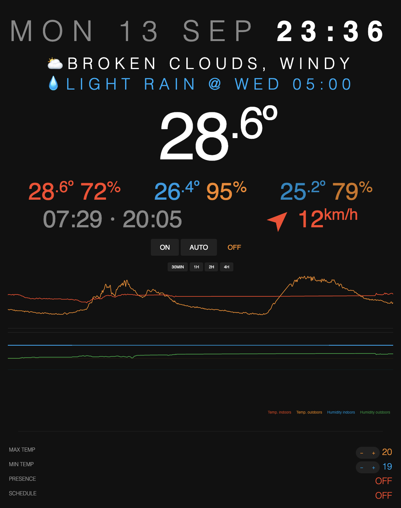
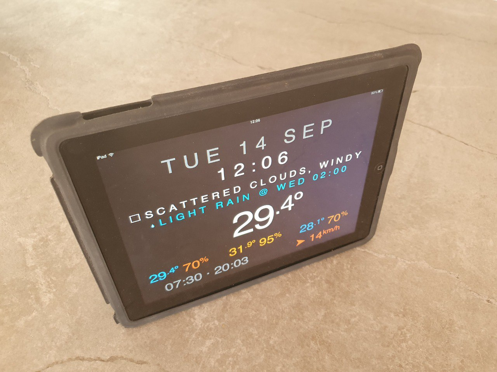
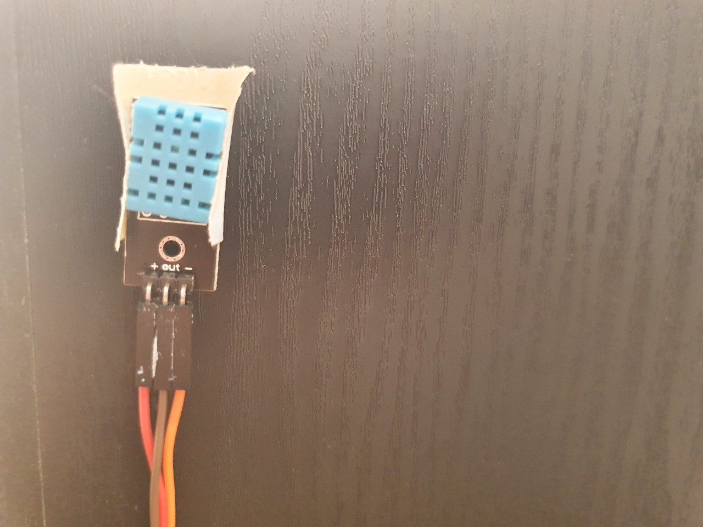
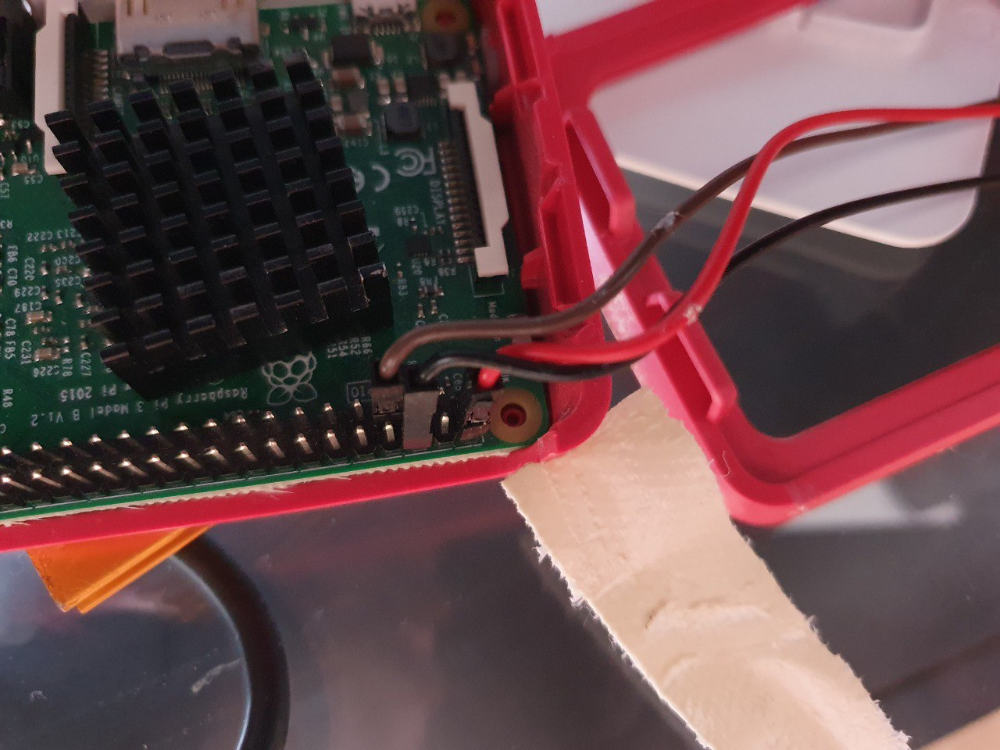
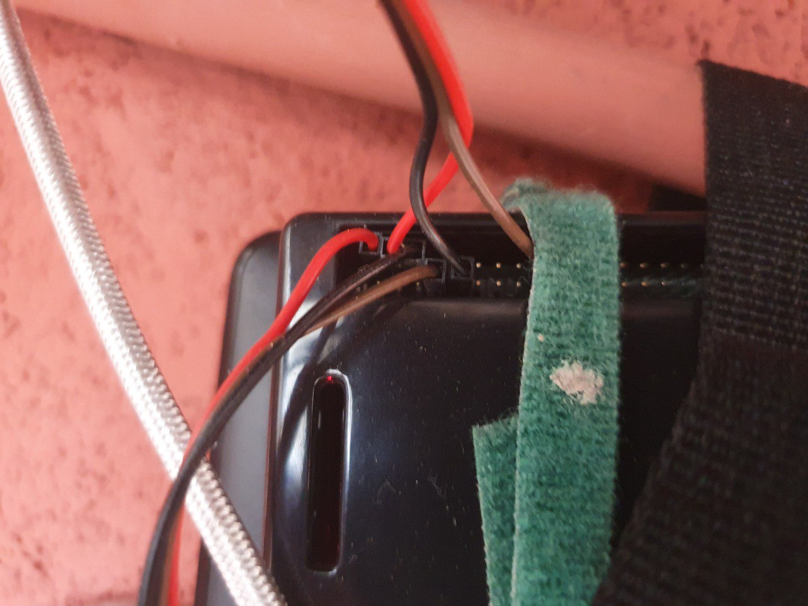
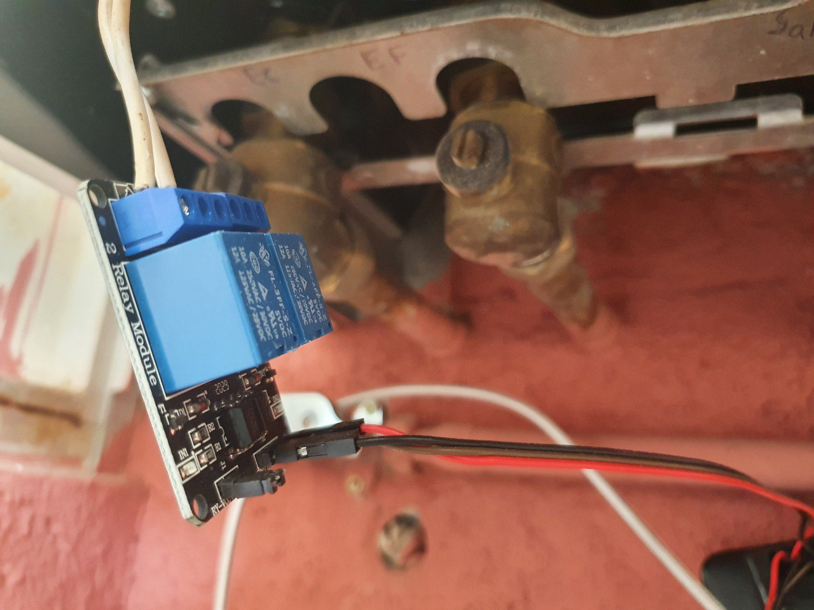

Thermostat
=======================

Smart Home Thermostat with Web interface, customizable options, weekly On/Off schedule programming, presence detector (respects privacy) and weather data.



_I've posted more photos at the bottom of the README._

## Features

- Control your home thermostat with your phone, laptop or tablet
- Clean web interface with Temperature and Humidity charts
- Weather data from external API (wind speed, pressure, etc.)
- Unlimited sensors for indoors and outdoors
- Access your thermostat from anywhere in the world
- Privacy-respectful presence detection that turns thermostat off automatically if nobody is home
- Compatible with extremely old devices (iPad 1, etc.) so you can give them another life
- Extremely easy to set up, no compiling, frameworks or libraries needed, just vanilla JS and PHP
- Extremely easy to hack and customize to your liking


**Disclaimer**: _Please do your own research, you will be dealing with hardware components. I may have made mistakes or your particular setup may differ._


## What you need (minimum-ideal)

- 1-2 Raspberry Pi (non-exclusive, you can use them for other things simultaneously such as for Kodi, Syncthing or PiHole)
- 1-2 temperature sensors (the second one is optional if you want outdoors measuring, although the weather API works too)
- 1 relay switch to turn ON-OFF the thermostat
- Cable (Dupont wires, although any old/broken USB or phone cable works too)

### Setup overview

- Run one Python script on each Raspberry Pi (set a 5 min cronjob)
- A simple PHP web server with a few files (no MySQL database needed)
- A free API key from openweathermap to get your location's weather


### Shopping list

These are the things I bought and have worked for me, your setup may vary.

- Raspberry Pi (any works, I've got a 3 and a 4)
- [DHT11 Temperature sensors](https://amzn.to/3tbv3LE) (around 3€ each)
    - or [DHT22 Temperature sensors](https://amzn.to/3zfUe24) (around 6€ each)
- [Relay](https://amzn.to/3teyIbK) (5€)
- [Cables](https://amzn.to/3wSyWra) (7€)
- (optional) [Multimeter](https://amzn.to/2Q3ownQ) (15€)
- (optional) [Digital Ocean web server](https://www.digitalocean.com/?refcode=b64e38702701) (4€/month, use the link for 2 months free)

TOTAL: 34€ (for a 300-500€ thermostat! 🥳)


#### DHT11 or DHT22 sensor, which one should you choose?

The DHT11 is cheaper but less accurate, it cannot detect temperatures below 0°C and humidity-wise is not very precise, so if you live in a cold area or need humidity to be really accurate, get the DHT22. I got the DHT11 when starting this project just because I didn't have any idea if it would even work, now that I've been running Thermostat for more than a year I've just ordered the DHT22.


### Compatibility

Compatible with very old devices (including iPad 1 and probably old Internet Explorers) so you can use retired devices as controllers/displays, they just need a somewhat decent web browser. The Web interface has been coded in a way that doesn't require too modern web technologies.


## My setup

I've got two Raspberry Pi: one I use it for watching TV (using OSMC + Kodi) so it sits besides my TV in the living room and the other one is a file backup generator (using Syncthing) placed next to my thermostat.

Raspberry 1 will detect indoor temperature and presence, and Raspberry 2 will detect outdoors temperature and activate the Thermostat On/Off through the relay.

My Thermostat activates through a cable running at 26.7VAC 8.68mA (measured thanks to the Multimeter I bought for 15€). When this cable is bridged it turns ON, and when you unbridge it it turns Off. I got a relay which can handle up to 250V and 10A, it's inexpensive and you'd better get something decent for safety reasons and so you can reuse for other projects.


### Overview

- Raspberry 1 (indoors, living room)
    - Hardware:
        - Temperature sensor
    - Software:
        - Send temperature and humidity
        - Detect presence
- Raspberry 2 (outdoors, next to the thermostat)
    - Hardware:
        - Relay (on/off switch) connected to the Thermostat cable
        - Temperature sensor (placed outdoors with a long cable so we get accurate exterior temperature)
    - Software:
        - Send temperature
        - GET `/status` to see if 1 or 0 and turn on or off the rele (HARD)
- Web Server (PHP, SQLite, Apache):
    `sudo apt install php7.4-sqlite3`
    - PHP script
        - Web portal
            - User Interface
            - Buttons to turn thermostat On/Off and set an On timer ("_set it on for 30 minutes_")
            - Charts, indoor/outdoor/city temperatures and humidity, thermostat status, event logs
            - Customize the temperature range
        - API
            - Receive data from all devices
            - Return thermostat status


## SETUP

### Generate a security token

You can use this tool https://xaviesteve.com/pro/tools.php (Password generator) to create a 128-256 string and save it in a file called `.httoken`. Place this file in the same folder as your `thermo.py` and `index.php` scripts.

### Customize parameters

(optional) You can edit `index.php` (or `params.php` once it has been generated on first run) to customize a few extra settings such as the weekly schedule, your coordinates, Weather API key and so on.


### Web Server

A PHP server with SQLite.

```sh
sudo apt install php7.4-sqlite3
```


### Thermostat Raspberry

For the Raspberry with the Thermostat ON/OFF Relay:

```bash
sudo apt update
sudo apt install wiringpi

# You probably don't need this: `sudo apt install python3-rpi.gpio python-pip`
# This shows info on all pins `gpio readall`
```

### Presence Raspberry

For the Raspberry that will do the presence detector

```bash
pip install pythonping
```

Now give your smartphones' fixed IPs and add them to the `thermo.py` file.


### Temperature Raspberry DHT11

For the Raspberry with the temperature sensor:

```bash
sudo apt install git-core
git clone https://github.com/szazo/DHT11_Python.git
cd DHT11_Python
sudo apt install python3-pip
pip3 install -U setuptools
python3 -m pip install .
```

The GPIO pins for the DHT11 temperature sensor that I have used looks like this (Raspberry Pi 4B, 3B+, 3B, 3A+, 2B, B+, A+, Zero, Zero W):

```
                |
···········7··· |
············6·2 |
----------------/
```

- Pin 2 (5V): +
- Pin 6 (Ground): -
- Pin 7 (GPIO4): Data/out


### Temperature Raspberry DHT22

You will need a 10k ohm resistor as per https://pimylifeup.com/raspberry-pi-humidity-sensor-dht22/ instructions, this means you'll either need a board or to solder a bit, which may be inconvenient if you're just starting out. While you could exclude the resistor you will likely start to get unreliable measurements from the sensor.

Pins are like this in the 4-pin white DHT22:

```
####
####
####
||||

1234

1: Voltage
2: Data
3: (nothing)
4: Ground

```


### All Raspberries

Set a static IP on all your Raspberry Pi

```bash
sudo nano /etc/resolv.conf
```

Scroll to the bottom and add this:

```bash
interface wlan0
static ip_address=192.168.0.201/24
static routers=192.168.0.1
static domain_name_servers=192.168.0.1
```

Now put the token on all your Raspberry Pi:

```bash
cd ~
nano .httoken
# Paste the generated token and save the file
```

Install the script on all your Raspberry Pi:

```bash
nano thermo.py
# Paste the thermo.py code
# Customize the tasks you want this Raspberry to do
# Save the file and exit nano
chmod u+x thermo.py
./thermo.py
```

Install the cron on all your Raspberry Pi

```bash
sudo apt install cron
crontab -e
```

Cronjob (every 5 minutes)

```bash
@reboot /home/pi/thermo.py
*/5 * * * * /home/pi/thermo.py
```


### Other useful commands

#### To run the script manually do

- `~/thermo.py`

#### To set pin 24 to High

`gpio -g mode 24 out`
`gpio -g write 24 1`


## Frequently Asked Questions

### How does presence detection work?

I hated the idea of having cameras or microphones listening all the time or watching me so I came with the idea of simply tracking if a specific IP address is connected to the home's Wi-Fi. For example, my mobile phone. If I'm home, my phone will be with me and auto-connect to the Wi-Fi, and disconnect when I leave home.

It doesn't track individually, it just tracks if there's any of the IP addresses in the list connected to the network. You could even set your smart TV to be the device, or a smart bulb, or a desktop computer. If you set your phone and want to become undetected, simply disable Wi-Fi and use cellular data to remain undetected, or change your IP address to another one that's not in the list.


### How much power does it consume?

Right now my Raspberry Pi Zero W is using between 0.6 and 0.9W. 

The Raspberry Pi 3 B+ uses 3W but it has Syncthing in it with an old external USB drive, it can go up to 7W whenever it's syncing a lot of stuff and the CPU is at max.


## Photos of my setup

This is how Thermostat looks like on an iPad 1, I have it in my living room and it works great as a clock and a weather station to see when it's going to rain:



The DHT11 placed on a wooden surface away from any heat source or air current:



How I've connected the DHT11 temperature sensor:



The Raspberry with the DHT11 temperature sensor and the Relay to turn on/off the thermostat:



The relay connected to the thermostat:


